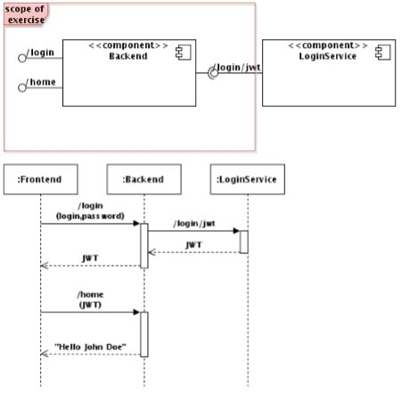

#Applicant Task: Service Development (JWT)

##Problem
Write the backend for a tiny web application. The requirements are:

* All external communication is done via JSON / REST API, but there are no further restrictions to formats, etc. except those explicitly given. 
* When a user logs in a request is sent to the backend URL path "/login", which handles JWT negotiation/generation with a separate, private service. 
* When a logged-in user is redirected to the home page, a request is sent to the backend URL path "/home". The backend answers using the user's full name 
provided by the JWT process. 

##Preparation
Explore the basic concept of (JSON Web Token) and (component testing how to)

##Tasks

- Write appropriate tests to the new backend component. Mock the LoginService where necessary. 
    * Call /home w/o JWT and expect an appropriate HTTP error code. 
    * Call /home w/o feasible JWT and expect an appropriate HTTP error code.
    * Call /home w/ a feasible JWT for user "John Doe" and expect a welcome message including that name. 
    * Call /login w/o login or password and expect an appropriate HTTP error code. 
    * Call /login with providing a JWT and expect an appropriate HTTP error code. 
    * Call /login with "feasible" login and password (the mock accepts it) and expect the matching JWT. 

- Write the backend component to get the tests green. 
- Write contract test(s) to the LoginService and use/write a mock to get them green. 
- Do some refactoring, if necessary.

Use a JVM language (Java or Scala preferred, but no exclusions). 
Use the frameworks, tools and libraries of your choice (e.g. JUnit, Spring, Tomcat, Play, Dropwizard).
Provide the code and build scripts / receipt as well as the compiled code (if applicable). 
If possible provide a Docker container or Vagrant VM running the component.

----

#Solution

This has been implemented using spring security. This means that the controller classes are basically empty as everything is done in spring.

## Approach

A JWT Authentication type and its related provider class have been implemented to be able to use the JWT as an authentication method.

2 Filters have been implemented:

* the SpringSecurityAddJWTTokenFilter to add the JWT to the http response upon login
* the SpringSecurityJWTAuthenticationFilter to feed a passed JWT Bearer authentication header into the spring security
 
 Most of the magic is the configuration of the HttpSecurity in the ApplicationSecurity @Configuration class. Here we configured the credentials for johndoe 
 for basic http authentication and configured access security for the rest endpoints as well as the filters. 

## Issues

The login service has not been modeled properly as it was supposed to be mocked anyway. 
It would require an additional authentication provider for basic http auth.

A sample implementation can be found here <http://www.baeldung.com/2012/12/20/authentication-against-a-restful-service/>

